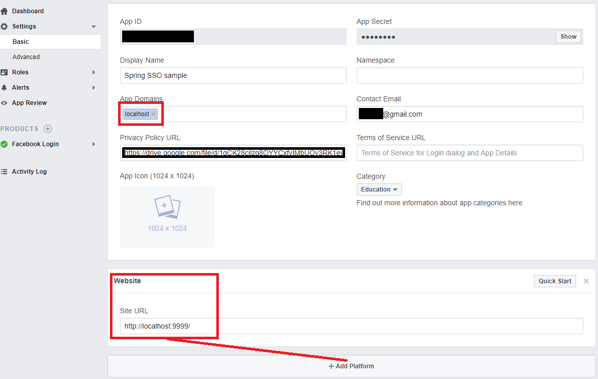

# Build
`./gradlew build`

# Run applications

## Run eureka
Run **eureka** in default configuration. First instance will run with exceptions - never mind. There is no other instances from defaultZone yet.

## Run config-server
0. [Patch JRE with JCE policy files](http://www.oracle.com/technetwork/java/javase/downloads/jce8-download-2133166.html)   
1. Initialize keystore and create docker image of **config-server**, then run it and follow instructions.  
```
./run_all.sh -k $some_key -s $some_secret

```

2. Now that we have an encrypted repo password and docker image, we can run **config-server** with encrypted password.  
```
docker run --name config-server --net=host -p 8890:8890 -e SPRING_PROFILES_ACTIVE=keystore -e KEY_PWD=$some_key -e KEYSTORE_PWD=$some_secret net.ins.hw.netflix/config-server:0.0.1 --spring.cloud.config.server.git.password='{cipher}$SECRET_FROM_PREVIOUS_STEP'  
```

*Running from IDE:* set `--spring.profiles.active=keystore,organization` cmd line args
along with `JKS_DIR`, `KEYSTORE_PWD`, `KEY_PWD` env variables. 

3. Check that **config-server** works correctly 
```
curl -XGET http://localhost:8890/orders-api/vanaheim | jq
```
where `orders-api` is an application name and `vanaheim` is a profile.  
Successful response example:
```json
{
  "name": "orders-api",
  "profiles": [
    "vanaheim"
  ],
  "label": null,
  "version": "9d2d4585e37762a30c28953f527d9fa665ce0ba4",
  "state": null,
  "propertySources": [
    {
      "name": "https://bitbucket.org/ins-ms/infra-configs.git/orders-api-vanaheim.yml",
      "source": {
        "spring.data.mongodb.uri": "mongodb://vanaheim:27017/orders",
        "spring.data.mongodb.repositories.enabled": true
      }
    },
    {
      "name": "https://bitbucket.org/ins-ms/infra-configs.git/application.yml",
      "source": {
        "hystrix.command.default.execution.isolation.thread.timeoutInMilliseconds": 5000,
        "management.security.enabled": false
      }
    }
  ]
}
``` 

## Run auth server
Currently working with github SSO. Notice that `clientId` and `clientSecret` for spring oauth2 are populated from `config-server` and
stored in git repo (decoded by key from **config-server.jks**)


# Config encryption
Property encryption example:
```bash
curl http://config-server-url:config-server-port/encrypt -d $VALUE_TO_BE_ENCRYPTED
```
Result can be set into properties in `'{cipher}$ENCRYPTED_VALUE'` notation and can be stored in public repo. Example:
```yaml
security:
  oauth2:
    client:
      client-id: '{cipher}AgCE7pImRRO9FkxtjtbYpHqOFRbMiukjsFydvn6VW06IPtM/VESKNRncYcy3UgnoLnUREiTeJhtxrDRcoTOxeaqLpPJB2m2VKIP4vjBEwq2VkeIskL0fGlfn01VDBjhKDMek5IbVQMaZ/RzSOVFhPxeFWucp0zoSc45Gaek6sEnI7KaRmZusD6vFTf02OTs9jGrTUtihmtMpPjziuOT9MWx9aKuPln6xjB4gDTAHSrcobJdVsSbw7gUNAtBnw+xsjorZO07IumAvayE8P9oB42r2xFVl7p2m/aaVNeOfu06ZtVsZssVqosjNaDRVr7z7VEQ9xO6EAtoAeSBrpEj+1Mhtbw6G7bGVdeIesaTl/36EVFdhOYYvy5TbZCEyVENYc/eSyow4jWKC3DUbeyKNc/6Aa2oVQueyFl7dJ0hUQOMAsessJdTbFG+FiGghKbEs6DPeRgoNpeE/uKoNNNhjBsdKMHsjBhWYc9UiNxbK3NOeGOMmucArWigWmyDKQjMMnhNeV0DR/cn99DaNc2HrJu2yO2q74MxmjePItymreQVOwmbs3YBAsQ7A9nFQhOMqzmU1ChuVI3XGL3xZ2w8PlaTgsSS1Naa0l0ZW1VN+6cfQp/70IGUYD+et4Z8CMd3l6Npr3BNk+jj0Xujb6avfOxFJ/mvdzOaFJ7x+yHt+TvbDdN++Vh8fd+Th6SXGiVF0UOKHk3A6WpFQWN90TvjJ3I5CE+VOMfrTmaPr2SKbi9Mw2Q=='
      client-secret: '{cipher}AgClsEGBIKgJrNgiRsD1VsLH8kLeHgN+hIAJsBQ9nw6FvA9Nh+0viCn6MuxRcAtE5K9K87GOYK8GQ3g35FoLS+X/8sb887mwOB1xmV+9wk73a9gJVqGcAypvoSPGclQWVWHTum04ZITO+xFrHo39c2ehULXiQsV1ax7tvGUcqGp99AAIixwp214BWiSAlU5Bz2dCgjwMjF5z/i/kT3UiQdLad9U6ObqtEVfSgY9GPuPeDAgREde/O9q8gicvzhK7whlEHKdgrQtxRtUu/wqRlard8sXaazkSEInLWjGmYVQZcH5oOmFTa378LJh1e90D36oMxZp8UbvoIIrbQ3ZUlmZhvfeDxqkcMMvQSmStFsmpY/6Gy00abupkhQ69dnXk49pmEXABWx2yaWZ3pExFro+RfWjwlcKPL5bJVcLC0EFEBIztZULT2SyRWQ9hLcdmV32ekBgiXqi1sftZJLus7SU67DNQt1WVjzbYwnYhbRB4SY0zuSWPb/G8fNu5G9evrQIeEwgshs9FqfrwGM7L4CFHdyELWFlcvPB5vhFtUNxJSpV0RqBGAA7ewaR7/XCKDWQuBBJYdLKQnRjAYc2Jv3rHJYKp7Yts4JYScwYNIl8Hc66xjvn+szDFiDH6kekTuP1otmd31oJJYoLfifEeTT0mwpWxjzsTq7dSzEee+rtSHN21T8Q0DH2nsEmhryyqNLCIgrXiN+af/mPCifr5J4cbePxxlK1WBV3whs3oeXF+j1W/RFyKav+KtRxbL/fPfJY='
```

# OAuth2 configuration
## Spring 
[Best tutorial ever?](https://spring.io/guides/tutorials/spring-boot-oauth2/#_social_login_simple)

# Github SSO settings
[Github SSO help page](https://developer.github.com/apps/building-oauth-apps/authorization-options-for-oauth-apps/)

# Facebook SSO settings
1. Add `Website` Platform
2. Add it to `App Domains`
3. Create and set URL to Privacy Policy: https://stackoverflow.com/a/48134670/1793381
   
